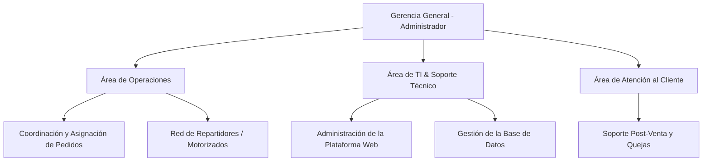
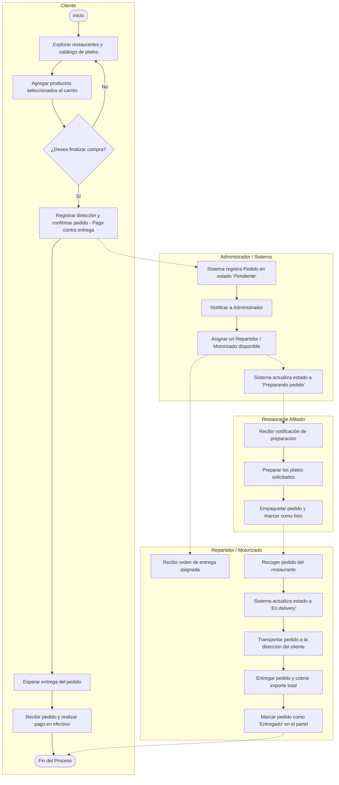
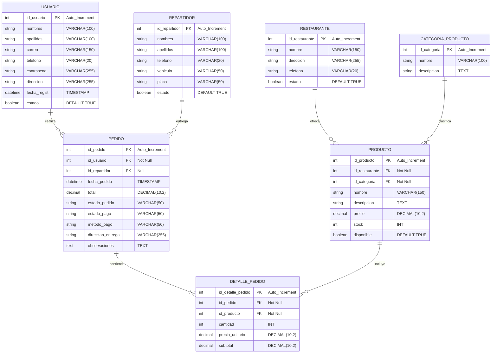

# 📦 ChasquiPedidos - Aplicación Web de Delivery
## 🚀 Guía Completa de la Tercera Entrega (Segundo Avance Oficial)

Este archivo sirve como guía de estudio y documentación técnica detallada sobre la **Tercera Entrega (Segundo Avance Oficial)** del proyecto **ChasquiPedidos**. Está estructurado específicamente para ayudarte a sustentar y explicar cada punto requerido en la rúbrica de calificación ante tu docente.

---

## 📋 1. Ficha Técnica del Proyecto

*   **Nombre de la Institución:** ChasquiPedidos
*   **Giro del Negocio:** Servicios de delivery y logística de comida para restaurantes locales.
*   **Ubicación Física:** Av. Ejército 738, Cayma, Arequipa, Perú.
*   **Público Objetivo:** Usuarios que desean ordenar comida a domicilio en Arequipa y restaurantes locales que requieren una pasarela digital y logística de reparto.
*   **Tecnologías Clave:**
    *   **Backend:** Java 21, Spring Boot 3.2.5, Spring Data JPA.
    *   **Gestor de Dependencias:** Maven.
    *   **Base de Datos:** MySQL (Base de datos: `chasqui_pedidos_db`).
    *   **Frontend:** HTML5, CSS3, JavaScript (Vanilla), Bootstrap, motor de plantillas Thymeleaf.
    *   **Validaciones:** Jakarta Validation Constraints.

---

## 🏢 2. Estructura Organizativa (Organigrama)

ChasquiPedidos posee una estructura funcional óptima para la administración de la plataforma digital y el despacho logístico:



*   **Gerencia General (Administrador):** Administra el catálogo global, aprueba y asigna motorizados y supervisa las ventas del sistema.
*   **Área de Operaciones:** Controla el despacho de las órdenes y monitorea el estado del envío.
*   **Red de Repartidores:** Los motorizados encargados de realizar la entrega final y el cobro contraentrega.
*   **Área de TI:** Mantiene el servidor web y la base de datos MySQL en funcionamiento óptimo.
*   **Atención al Cliente:** Administra las quejas o devoluciones mediante el Centro de Reclamaciones integrado.

---

## ⚙️ 3. Flujo del Proceso de Negocio (BPMN)

El proceso de negocio cubre el **100% de la lógica del proyecto**, desde que el cliente inicia sesión hasta que se procesa el cobro contra entrega:



---

## 🗄️ 4. Modelo Entidad-Relación (Base de Datos)

La base de datos `chasqui_pedidos_db` está totalmente normalizada y estructurada para soportar relaciones complejas:



### Relaciones del ORM (Explicación para clase):
1.  **`Usuario -> Pedido` (1:N):** Un cliente puede tener múltiples pedidos históricos, pero cada pedido pertenece a un solo cliente (`@OneToMany` y `@ManyToOne`).
2.  **`Pedido -> DetallePedido` (1:N):** Un pedido desglosa múltiples filas de productos comprados (`@OneToMany` bidireccional).
3.  **`Producto -> DetallePedido` (1:N):** Un producto puede aparecer listado en los detalles de múltiples compras.
4.  **`Restaurante -> Producto` (1:N):** Un restaurante ofrece varios platos en su menú.
5.  **`Repartidor -> Pedido` (1:N):** Un motorizado puede entregar varios pedidos asignados secuencialmente.

---

## 🛠️ 5. Mapeo ORM & Validaciones (Explicación del Código)

### ¿Qué es el ORM y cómo lo aplicamos?
El **Mapeo Objeto-Relacional (ORM)** asocia clases de Java a tablas de base de datos MySQL. En el código, utilizamos **Spring Data JPA** con anotaciones de Hibernate.

*   `@Entity` define que la clase mapea una tabla.
*   `@Table(name = "...")` define el nombre físico de la tabla.
*   `@Id` y `@GeneratedValue(strategy = GenerationType.IDENTITY)` configuran la clave primaria autoincremental.

### Validaciones en Servidor (Jakarta Validation)
Para asegurar que no entren datos inconsistentes, añadimos validaciones a nivel de entidad. Si se intenta guardar un registro inválido, Spring arroja una excepción automáticamente.

```java
// Ejemplo de validaciones en Usuario.java
@NotBlank(message = "El nombre no puede estar vacío")
@Size(max = 100, message = "El nombre no puede superar los 100 caracteres")
@Column(nullable = false, length = 100)
private String nombres;

@NotBlank(message = "El correo no puede estar vacío")
@Email(message = "El formato del correo es inválido")
@Column(length = 150, unique = true)
private String correo;
```

---

## 🌐 6. Arquitectura y Diseño REST (APIs)

Para esta entrega se diseñaron e implementaron APIs RESTful que realizan operaciones CRUD sobre las entidades primarias.

### Endpoints Implementados (`Usuario` y `Restaurante`):

*   **`GET /api/usuarios`:** Retorna la lista completa de usuarios en formato JSON (`200 OK`).
*   **`GET /api/usuarios/{id}`:** Busca un usuario específico. Si no existe, retorna `404 Not Found`.
*   **`POST /api/usuarios`:** Registra un nuevo usuario. Utiliza `@Valid` para validar el JSON del Request Body. Retorna `201 Created` si es exitoso o `400 Bad Request` si fallan las validaciones.
*   **`PUT /api/usuarios/{id}`:** Actualiza todos los campos de un usuario existente.
*   **`DELETE /api/usuarios/{id}`:** Elimina un usuario por su identificador único.

### Ejemplo de Implementación en Código (`RestauranteRestController.java`):
```java
@RestController
@RequestMapping("/api/restaurantes")
public class RestauranteRestController {

    @Autowired
    private RestauranteRepository restauranteRepository;

    @GetMapping
    public List<Restaurante> getAllRestaurantes() {
        return restauranteRepository.findAll();
    }

    @PostMapping
    public ResponseEntity<Restaurante> createRestaurante(@Valid @RequestBody Restaurante restaurante) {
        Restaurante nuevoRestaurante = restauranteRepository.save(restaurante);
        return ResponseEntity.status(HttpStatus.CREATED).body(nuevoRestaurante);
    }
}
```

---

## 🖥️ 7. Guía de Ejecución Local

Para levantar el proyecto en tu computadora y probarlo antes de clase, sigue estos pasos:

1.  **Requisitos:** Tener instalado **JDK 21** y **MySQL Server**.
2.  **Configurar Base de Datos:** Abre MySQL y crea la base de datos:
    ```sql
    CREATE DATABASE chasqui_pedidos_db;
    ```
3.  **Configurar Credenciales:** Abre el archivo `app/src/main/resources/application.properties` y verifica los campos de conexión:
    ```properties
    spring.datasource.url=jdbc:mysql://localhost:3306/chasqui_pedidos_db?createDatabaseIfNotExist=true&serverTimezone=UTC
    spring.datasource.username=TU_USUARIO_MYSQL (usualmente 'root')
    spring.datasource.password=TU_CONTRASEÑA_MYSQL
    ```
4.  **Ejecutar el Servidor:** 
    *   Abre una terminal PowerShell en la carpeta `app/`.
    *   Ejecuta:
        ```powershell
        $env:JAVA_HOME = "RUTA_A_TU_JDK_21"; ./mvnw spring-boot:run
        ```
5.  **Probar en Navegador:** Abre [http://localhost:8080](http://localhost:8080) para interactuar con la aplicación.

---

## 🗣️ 8. ¿Cómo defender y explicar este avance ante el Jurado?

Usa este guion estructurado para tu exposición oral:

> *"Estimado profesor, para este segundo avance oficial de **ChasquiPedidos**, nos hemos enfocado en implementar la robustez de los datos y el desacoplamiento de servicios.
>
> 1. **Análisis del Negocio y Flujo:** Primero, diagramamos el flujo de procesos en BPMN cubriendo el 100% de la lógica operativa (desde la compra del cliente hasta el cobro contra entrega). Esto se soporta en un organigrama funcional y en un modelo Entidad-Relación completamente normalizado en MySQL.
>
> 2. **Capa de Persistencia y ORM:** Para conectar nuestra aplicación con la base de datos, implementamos Spring Data JPA. Mapeamos las clases Java correspondientes a las tablas de la base de datos y establecimos las relaciones necesarias (tales como la relación de uno a muchos entre un Usuario y sus Pedidos, y de muchos a uno de un Producto a su Restaurante).
> 
> 3. **Validación de Datos en Servidor:** Para evitar inconsistencias de datos, añadimos validación en la capa de modelo con Jakarta Validation. Campos sensibles como el correo electrónico o el teléfono tienen restricciones de longitud, formato y obligatoriedad.
>
> 4. **Capa de Servicios REST:** Finalmente, diseñamos e implementamos controladores REST para las entidades primarias. Esto permite realizar operaciones CRUD asíncronas devolviendo respuestas JSON estructuradas con códigos de estado HTTP estándar (200, 201, 404), facilitando la escalabilidad del sistema ante una futura aplicación móvil."*
