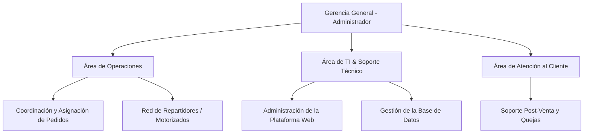
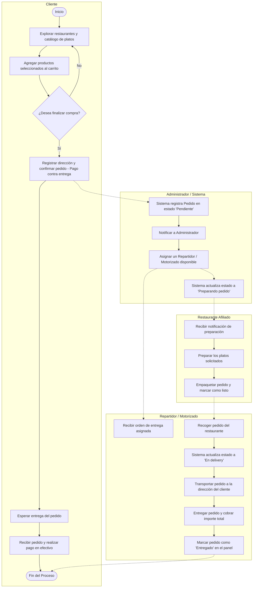
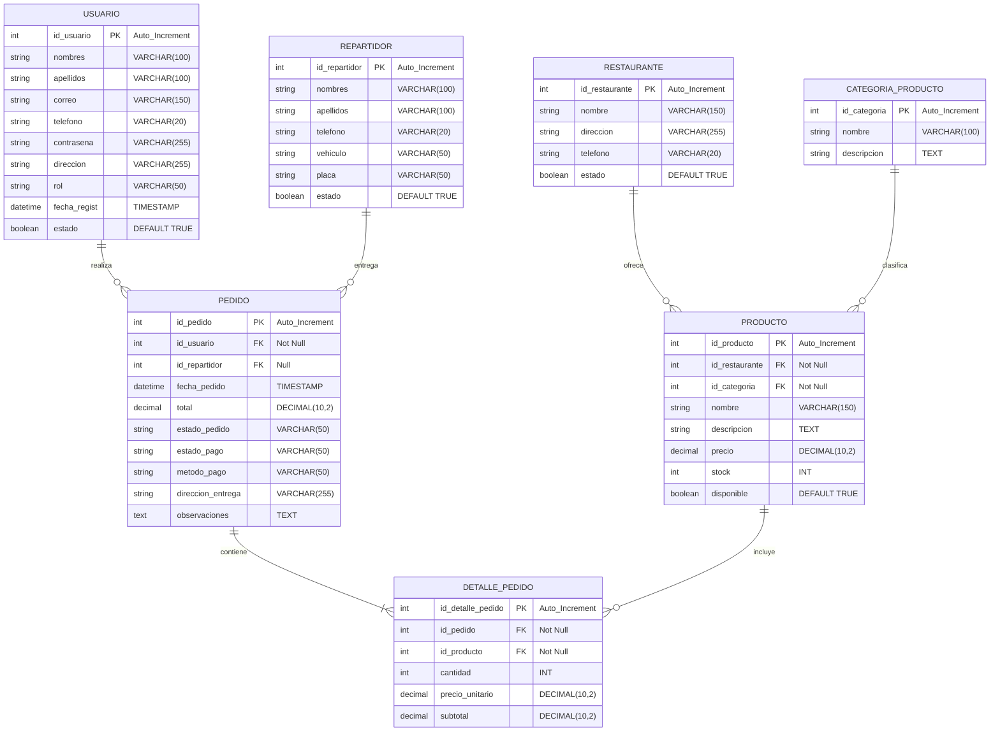

# 🎓 INFORME DE PROYECTO FINAL: CHASQUIPEDIDOS
## APLICACIÓN WEB DE DELIVERY Y GESTIÓN DE PEDIDOS

---

### **FACULTAD DE INGENIERÍA**
#### **Carrera de Ingeniería de Sistemas e Informática**
**Curso:** Marcos de Desarrollo Web  
**Profesor:** Omar Julio Valencia Gallegos  

**Integrantes (Grupo):**
* **U23304748** - Huamani Mejia, Cristofer Adrian
* **U23242026** - Davila Guerra, Duvan Isai
* **U24315072** - Mercado Chuctaya, Jose Manuel
* **U25310538** - Huayhua Huisa, Gilder Manuel
* **U23262556** - Alejo Alvarez, Yamilet Mayte

**Año Académico:** 2026  

---

## 📄 ÍNDICE GENERAL
1. **Descripción del Trabajo**
2. **Análisis del Contexto**
   * 2.1. Descripción de la Institución
   * 2.2. Organigrama de la Empresa
3. **Problemas Identificados**
4. **Objetivos**
   * 4.1. Objetivo General
   * 4.2. Objetivos Específicos
5. **Propuesta de Solución y Tecnologías**
   * 5.1. Arquitectura de Solución
   * 5.2. Tecnologías Utilizadas (Justificación)
6. **Alcances y Limitaciones**
   * 6.1. Alcance Técnico
   * 6.2. Limitaciones del Proyecto
7. **Diagrama BPMN (Proceso de Negocio)**
8. **Modelo Entidad-Relación (ER)**
   * 8.1. Diagrama ER
   * 8.2. Descripción de Tablas, Atributos y Restricciones
9. **Diseño del FrontEnd (Maquetación e Interfaces)**
   * 9.1. Arquitectura de Vistas (Bootstrap 5 y Fetch API)
   * 9.2. Ajustes y Optimizaciones Visuales Premium (`contain-fit`)
10. **Diseño del BackEnd (Mapeo ORM y Capa de Datos)**
    * 10.1. Entidades de Persistencia y Anotaciones de Relación
    * 10.2. Validaciones de Datos (Jakarta Validation)
    * 10.3. Interfaces Repositorio (Capa Spring Data JPA)
11. **Seguridad y Control de Acceso basado en Roles**
    * 11.1. Atributo Rol en la Sesión de Usuario
    * 11.2. Interceptor de Seguridad (`SecurityInterceptor.java`)
    * 11.3. Exclusión de Recursos y Rutas Públicas (Lectura como Invitado)
12. **Arquitectura y Diseño de Servicios REST (APIs)**
    * 12.1. Tabla de Endpoints REST
    * 12.2. Manejo de Errores Global (`GlobalExceptionHandler`)
13. **Módulo de Reportes e Informes (PDF y Excel)**
    * 13.1. Generación de PDF en Caliente (Biblioteca OpenPDF)
    * 13.2. Generación de Excel Dinámico (Biblioteca Apache POI)
    * 13.3. Controladores y Descarga del Lado del Cliente
14. **Dinamización del Dashboard Administrativo**
15. **Guía de Sustentación Oral y Demostración Práctica**

---

## 1. 📝 DESCRIPCIÓN DEL TRABAJO

El presente proyecto consiste en el desarrollo e implementación de una plataforma web transaccional denominada **ChasquiPedidos**, orientada a optimizar la gestión integral del proceso de delivery en la ciudad de Arequipa. El sistema automatiza el flujo de negocio de extremo a extremo, abarcando desde la exploración del catálogo digital por parte de clientes invitados o registrados, la configuración interactiva de carritos de compras, el procesamiento de pedidos bajo el método de pago contra entrega, hasta el seguimiento visual y dinámico del estado de entrega. 

Adicionalmente, la plataforma incorpora un robusto Panel de Administración (Dashboard) que proporciona control total del inventario, gestión de usuarios, creación de categorías y administración directa de repartidores motorizados, respaldado por un estricto control de accesos basado en roles y un módulo automatizado para la exportación de reportes e informes en tiempo real en formatos PDF y hojas de cálculo de Excel.

---

## 2. 🔍 ANÁLISIS DEL CONTEXTO

### 2.1. Descripción de la Institución
* **Nombre:** ChasquiPedidos S.A.C.
* **Ubicación:** Av. Ejército 738, Cayma, Arequipa, Perú.
* **Rubro de negocio:** Servicios de intermediación y delivery de comida y productos de restaurantes locales.
* **A qué se dedica:**
  ChasquiPedidos es una empresa arequipeña que conecta la oferta gastronómica de diversos establecimientos y restaurantes locales con clientes a domicilio. Su negocio central consiste en consolidar los pedidos de los clientes, transmitirlos a las cocinas de los restaurantes asociados, y asignar motorizados de su red de distribución para recoger y entregar los alimentos de forma oportuna.

### 2.2. Organigrama de la Empresa
La estructura organizativa de la empresa está diseñada de manera funcional para garantizar que las operaciones, el mantenimiento informático y la atención post-venta fluyan sin contratiempos:



---

## 3. 🚨 PROBLEMAS IDENTIFICADOS

Antes de la propuesta del sistema web, **ChasquiPedidos** operaba a través de canales tradicionales (llamadas telefónicas y chats de WhatsApp), lo cual generaba las siguientes fallas críticas de negocio:
1. **Gestión Manual e Ineficiente:** El registro físico o manual de pedidos provocaba frecuentes errores humanos, pérdida de información y duplicidades.
2. **Falta de Catálogo Digital:** Los clientes no tenían acceso a una lista unificada de restaurantes, platos y precios actualizados en tiempo real.
3. **Ausencia de Trazabilidad:** El cliente final no conocía el estado de su orden (si estaba en preparación o en camino), lo que generaba saturación en el soporte telefónico.
4. **Dificultad de Administración:** La gerencia no disponía de un sistema centralizado para ver ingresos del día, inventarios de productos, usuarios registrados ni motorizados activos.

---

## 4. 🎯 OBJETIVOS

### 4.1. Objetivo General
Desarrollar una aplicación web de delivery de extremo a extremo que automatice los procesos de compra, asignación de despachos y administración de inventario de **ChasquiPedidos**, sustituyendo la operación manual por un entorno digital integrado y seguro.

### 4.2. Objetivos Específicos
* Implementar el registro público seguro de clientes y el inicio de sesión controlado mediante sesión HTTP.
* Crear un catálogo dinámico y responsivo con buscador en tiempo real y filtrado de productos por categorías.
* Desarrollar una interfaz de carrito de compras que permita gestionar cantidades y montos recalculados de forma dinámica.
* Desarrollar una barra visual de seguimiento de pedidos que refleje en tiempo real el estado en el servidor.
* Implementar un panel de control administrativo protegido que muestre métricas dinámicas de ingresos y estadísticas de base de datos en tiempo real.
* Configurar un interceptor de seguridad para restringir el acceso a módulos ADMIN.
* Diseñar un módulo de descargas para exportar informes detallados de pedidos y usuarios a PDF y Excel.

---

## 5. 💡 PROPUESTA DE SOLUCIÓN Y TECNOLOGÍAS

### 5.1. Arquitectura de Solución
La solución adopta un patrón arquitectónico de **3 Capas (Modelo-Vista-Controlador)** desacoplado en el backend mediante controladores REST que suministran datos JSON al frontend de forma asíncrona, promoviendo una experiencia ágil y responsiva (SPA - Single Page Application) basada en llamadas AJAX (Fetch API).

### 5.2. Tecnologías Utilizadas
* **Backend Framework:** Spring Boot 3.2.5 + Java 21 (JDK 21). Garantiza robustez, inyección de dependencias automatizada y compatibilidad de tipos moderna.
* **Capa de Persistencia:** Spring Data JPA + Hibernate. Mapea la base de datos a objetos de Java y gestiona transacciones relacionales complejas de manera automática.
* **Base de Datos:** MySQL. Motor de base de datos relacional rápido, robusto y altamente compatible.
* **Formatos de Reporte:** OpenPDF 1.3.30 (para reportes estructurados en PDF) y Apache POI 5.2.5 (para hojas de cálculo Excel `.xlsx`).
* **Frontend:** HTML5, CSS3 personalizado y Bootstrap 5 para el diseño responsive. JavaScript nativo (Fetch API) para el consumo de endpoints en segundo plano sin recargar la página.

---

## 6. 📐 ALCANCES Y LIMITACIONES

### 6.1. Alcance Técnico
* Registro e inicio de sesión seguro en el backend.
* Catálogo dinámico consumiendo base de datos y barra lateral interactiva con conteo automático de platos.
* Carrito de compras guardado en `localStorage` y procesamiento de orden contra entrega.
* Panel administrativo dinámico con alta, baja, modificación y consulta (CRUD) de Productos, Categorías, Repartidores y Usuarios.
* Generación automática de reportes PDF y Excel al vuelo.

### 6.2. Limitaciones del Proyecto
* La pasarela de pago simula la transacción en la entrega (pago contra entrega en efectivo).
* No incluye geolocalización satelital (GPS) activa en mapas en tiempo real del repartidor.
* La plataforma opera de manera exclusiva en entornos de navegadores web (desktop y móvil responsivo), sin aplicación nativa móvil Android/iOS.

---

## 7. 🗺️ DIAGRAMA BPMN (PROCESO DE NEGOCIO)

El siguiente flujo describe el comportamiento de negocio al 100% de cobertura del proyecto para todas las áreas implicadas:



---

## 8. 🗄️ MODELO ENTIDAD-RELACIÓN (ER)

### 8.1. Diagrama ER
El modelo lógico-relacional que soporta las transacciones de **ChasquiPedidos** se estructura de la siguiente manera:



### 8.2. Descripción de Tablas y Atributos
1. **USUARIO:** Almacena los credenciales y detalles de contacto de clientes e investigadores del sistema. El atributo `correo` es único y el campo `rol` define los accesos restringidos (`ADMIN`, `CLIENTE`).
2. **RESTAURANTE:** Contiene la información de los establecimientos locales con relación de uno a muchos hacia la tabla `PRODUCTO`.
3. **CATEGORIA_PRODUCTO:** Agrupa los platos para estructurar y filtrar la búsqueda en el menú digital.
4. **PRODUCTO:** Registra el nombre, precio, descripción e inventario de los platos. Cuenta con referencias foráneas hacia `RESTAURANTE` y `CATEGORIA_PRODUCTO`.
5. **REPARTIDOR:** Datos de motorizados de la red de entrega, incluyendo su tipo de vehículo y número de placa vehicular.
6. **PEDIDO:** Cabecera de la compra, almacena el estado del pedido, el estado del pago, el total de la compra y relaciona la transacción con un cliente y un repartidor asignado.
7. **DETALLE_PEDIDO:** Almacena los platos de cada orden, registrando la cantidad y el subtotal unitario histórico.

---

## 9. 🎨 DISEÑO DEL FRONTEND (MAQUETACIÓN E INTERFACES)

### 9.1. Arquitectura de Vistas (Bootstrap 5 y Fetch API)
El frontend de **ChasquiPedidos** se desarrolló sobre plantillas responsivas que aseguran una óptima visualización en pantallas de cualquier tamaño (móvil, tablet y desktop), impulsado por hojas de estilo personalizadas con efectos modernos (glassmorphism y bordes redondeados).

Las interfaces implementadas al 100% son:
1. **Inicio de Sesión (`login.html`):** Autenticación de usuarios mediante sesión HTTP.
2. **Registro de Usuarios (`registro.html`):** Formulario para la creación pública de nuevas cuentas de clientes.
3. **Catálogo de Productos (`index.html`):** Muestra tarjetas responsivas de los platos de la base de datos.
4. **Carrito de Compras (`carrito.html`):** Muestra el desglose de productos y permite modificar cantidades en caliente.
5. **Confirmación y Seguimiento (`seguimiento.html`):** Barra de progreso con 4 hitos dinámicos enlazada al servidor.
6. **Perfil de Usuario (`perfil.html`):** Muestra información personal e historial de pedidos.
7. **Dashboard de Administración (`admin.html`):** Interfaz unificada con pestañas dinámicas de administración general.

### 9.2. Ajustes y Optimizaciones Visuales Premium (`contain-fit`)
Para solucionar problemas de recorte de imágenes con proporciones verticales (como botellas de refrescos y platos individuales), se diseñó una optimización en el frontend:
* **Mapeo Inteligente:** En `home.js` se evalúa si el producto es una bebida o contiene pollo. De ser así, se le inyecta la clase CSS `contain-fit` a la etiqueta ``.
* **CSS Robustez:**
  ```css
  .restaurant-img img.contain-fit {
      object-fit: contain;
      background-color: #ffffff;
      padding: 6px;
  }
  ```
  Esto hace que las imágenes de estos productos se alejen de los bordes y se muestren completas con fondo blanco integrado, manteniendo las fotos de pizzas y hamburguesas en pantalla completa (`cover`).

---

## 10. ⚙️ DISEÑO DEL BACKEND (MAPEO ORM Y CAPA DE DATOS)

### 10.1. Entidades de Persistencia y Anotaciones de Relación
La persistencia relacional se implementa a través de JPA. A continuación se presentan fragmentos de código de las relaciones clave:

* **Entidad Producto (Relación Many-to-One):**
  ```java
  @Entity
  @Table(name = "PRODUCTO")
  public class Producto {
      @Id
      @GeneratedValue(strategy = GenerationType.IDENTITY)
      @Column(name = "id_producto")
      private Integer idProducto;

      @ManyToOne
      @JoinColumn(name = "id_restaurante", nullable = false)
      private Restaurante restaurante;

      @ManyToOne
      @JoinColumn(name = "id_categoria", nullable = false)
      private CategoriaProducto categoria;

      @Column(nullable = false, length = 150)
      private String nombre;

      private BigDecimal precio;
      private Integer stock;
      private Boolean disponible;
  }
  ```

* **Relación Pedido y Detalle (One-to-Many):**
  ```java
  @Entity
  @Table(name = "PEDIDO")
  public class Pedido {
      @Id
      @GeneratedValue(strategy = GenerationType.IDENTITY)
      @Column(name = "id_pedido")
      private Integer idPedido;

      @ManyToOne
      @JoinColumn(name = "id_usuario", nullable = false)
      private Usuario usuario;

      @OneToMany(mappedBy = "pedido", cascade = CascadeType.ALL, orphanRemoval = true)
      private List<DetallePedido> detalles;
  }
  ```

### 10.2. Validaciones de Datos (Jakarta Validation)
Para impedir el almacenamiento de datos vacíos o corruptos, se implementaron anotaciones de validación en los atributos de las clases:
* `@NotBlank(message = "...")` en nombres, apellidos, correos y contraseñas.
* `@Email(message = "...")` para comprobar el formato de las cuentas de correo.
* `@Min(value = 0)` en atributos de precio, stock y totales.
* `@Size(max = ...)` para restringir longitudes de campos en MySQL.

### 10.3. Interfaces Repositorio (Capa Spring Data JPA)
La interacción de persistencia con la base de datos se realiza heredando de `JpaRepository`:
```java
public interface PedidoRepository extends JpaRepository<Pedido, Integer> {
    List<Pedido> findByUsuarioIdUsuario(Integer idUsuario);
}
```

---

## 11. 🛡️ SEGURIDAD Y CONTROL DE ACCESO BASADO EN ROLES

### 11.1. Atributo Rol en la Sesión de Usuario
El atributo `rol` de tipo `String` en la entidad `Usuario` determina los permisos. Al iniciar sesión, el controlador Spring almacena el objeto en la sesión HTTP:
```java
session.setAttribute("usuarioLogueado", usuario);
```

### 11.2. Interceptor de Seguridad (`SecurityInterceptor.java`)
Se desarrolló un interceptor que evalúa si la petición requiere permisos de administrador (`ADMIN`) o inicio de sesión activo antes de que la petición llegue a los controladores del sistema:

```java
@Component
public class SecurityInterceptor implements HandlerInterceptor {

    @Override
    public boolean preHandle(HttpServletRequest request, HttpServletResponse response, Object handler) throws Exception {
        String uri = request.getRequestURI();
        HttpSession session = request.getSession(false);
        Usuario usuario = (session != null) ? (Usuario) session.getAttribute("usuarioLogueado") : null;

        // Rutas de administración y APIs críticas (Requieren ROL ADMIN)
        if (uri.startsWith("/admin") || uri.startsWith("/api/usuarios") || uri.startsWith("/api/restaurantes") || uri.startsWith("/api/categorias") || uri.startsWith("/api/repartidores")) {
            // Permitir creación de usuario pública para el registro de clientes
            if (uri.equals("/api/usuarios") && "POST".equalsIgnoreCase(request.getMethod())) {
                return true;
            }
            
            // Permitir lectura pública de categorías para el catálogo principal
            if (uri.startsWith("/api/categorias") && "GET".equalsIgnoreCase(request.getMethod())) {
                return true;
            }
            
            if (usuario == null) {
                response.sendRedirect("/login");
                return false;
            }
            
            if (!"ADMIN".equalsIgnoreCase(usuario.getRol())) {
                response.sendError(HttpServletResponse.SC_FORBIDDEN, "Acceso denegado: Se requiere rol de Administrador");
                return false;
            }
        }
        
        // Rutas de uso del cliente autenticado
        if (uri.startsWith("/carrito") || uri.startsWith("/seguimiento") || uri.startsWith("/perfil") || (uri.startsWith("/api/pedidos") && !"GET".equalsIgnoreCase(request.getMethod()))) {
            if (usuario == null) {
                response.sendRedirect("/login");
                return false;
            }
        }

        return true;
    }
}
```

### 11.3. Exclusión de Recursos y Rutas Públicas (Lectura como Invitado)
El interceptor está configurado en `WebConfig` para ignorar archivos estáticos (`/css/**`, `/js/**`, `/images/**`) y rutas generales de inicio (`/`, `/login`, `/registro`). Además, se excluyeron específicamente las peticiones de lectura `GET` de `/api/categorias` y `/api/productos` para que los clientes invitados puedan visualizar el catálogo libremente antes de loguearse.

---

## 12. 🌐 ARQUITECTURA Y DISEÑO DE SERVICIOS REST (APIS)

### 12.1. Tabla de Endpoints REST
El backend proporciona servicios JSON completos para administrar las entidades del sistema:

| Recurso / Entidad | Método | URI del Endpoint | Operación Realizada | Código HTTP |
| :--- | :--- | :--- | :--- | :--- |
| **Usuario** | `GET` | `/api/usuarios` | Listar todos los usuarios. | `200 OK` |
| **Usuario** | `POST` | `/api/usuarios` | Registro público / creación de usuario. | `201 Created` |
| **Usuario** | `PUT` | `/api/usuarios/{id}` | Actualización de perfil / datos. | `200 OK` |
| **Usuario** | `DELETE` | `/api/usuarios/{id}` | Eliminación física del registro. | `200 OK` |
| **Producto** | `GET` | `/api/productos` | Listar catálogo de productos. | `200 OK` |
| **Producto** | `POST` | `/api/productos` | Agregar nuevo producto. | `201 Created` |
| **Pedido** | `POST` | `/api/pedidos` | Confirmar y procesar orden de compra. | `201 Created` |
| **Repartidores**| `POST` | `/api/repartidores` | Registrar nuevo motorizado desde Admin. | `201 Created` |

### 12.2. Manejo de Errores Global (`GlobalExceptionHandler`)
Se implementó un controlador de consejos (`@RestControllerAdvice`) que captura excepciones de validación de campos, devolviendo respuestas JSON consistentes a las peticiones API:
```java
@RestControllerAdvice
public class GlobalExceptionHandler {

    @ExceptionHandler(MethodArgumentNotValidException.class)
    public ResponseEntity<Map<String, String>> handleValidationExceptions(MethodArgumentNotValidException ex) {
        Map<String, String> errors = new HashMap<>();
        ex.getBindingResult().getFieldErrors().forEach(error -> {
            errors.put(error.getField(), error.getDefaultMessage());
        });
        return ResponseEntity.status(HttpStatus.BAD_REQUEST).body(errors);
    }
}
```

---

## 13. 📊 MÓDULO DE REPORTES E INFORMES (PDF Y EXCEL)

### 13.1. Generación de PDF en Caliente (Biblioteca OpenPDF)
Se implementó la exportación en formato PDF mediante la biblioteca **OpenPDF**. El servidor lee los registros de la base de datos de manera dinámica y los renderiza en tablas estructuradas con formato de documento A4, añadiendo automáticamente un cálculo acumulado del total de ingresos en la parte inferior:

```java
@GetMapping("/pedidos/pdf")
public void exportarPedidosPDF(HttpServletResponse response) throws IOException {
    response.setContentType("application/pdf");
    response.setHeader("Content-Disposition", "attachment; filename=reporte_pedidos.pdf");

    List<Pedido> pedidos = pedidoRepository.findAll();

    Document document = new Document(PageSize.A4);
    PdfWriter.getInstance(document, response.getOutputStream());
    document.open();

    // Estilos de fuentes y cabeceras corporativas
    Font fontTitle = FontFactory.getFont(FontFactory.HELVETICA_BOLD, 18, new Color(0, 102, 204));
    Font fontHeader = FontFactory.getFont(FontFactory.HELVETICA_BOLD, 12, Color.WHITE);
    Font fontBody = FontFactory.getFont(FontFactory.HELVETICA, 10);

    Paragraph title = new Paragraph("Reporte de Pedidos - ChasquiPedidos", fontTitle);
    title.setAlignment(Paragraph.ALIGN_CENTER);
    title.setSpacingAfter(20);
    document.add(title);

    PdfPTable table = new PdfPTable(6);
    table.setWidthPercentage(100);
    table.setWidths(new float[] {1f, 2.5f, 2f, 1.5f, 1.5f, 1.5f});

    String[] headers = {"ID", "Cliente", "Fecha", "Metodo Pago", "Estado", "Total"};
    for (String header : headers) {
        PdfPCell cell = new PdfPCell(new Phrase(header, fontHeader));
        cell.setBackgroundColor(new Color(0, 102, 204));
        cell.setPadding(8);
        cell.setHorizontalAlignment(Element.ALIGN_CENTER);
        table.addCell(cell);
    }

    DateTimeFormatter formatter = DateTimeFormatter.ofPattern("dd/MM/yyyy HH:mm");
    BigDecimal granTotal = BigDecimal.ZERO;

    for (Pedido pedido : pedidos) {
        table.addCell(new PdfPCell(new Phrase(String.valueOf(pedido.getIdPedido()), fontBody)));
        table.addCell(new PdfPCell(new Phrase(pedido.getUsuario().getNombres() + " " + pedido.getUsuario().getApellidos(), fontBody)));
        table.addCell(new PdfPCell(new Phrase(pedido.getFechaPedido() != null ? pedido.getFechaPedido().format(formatter) : "", fontBody)));
        table.addCell(new PdfPCell(new Phrase(pedido.getMetodoPago(), fontBody)));
        table.addCell(new PdfPCell(new Phrase(pedido.getEstadoPedido(), fontBody)));
        
        BigDecimal total = pedido.getTotal() != null ? pedido.getTotal() : BigDecimal.ZERO;
        table.addCell(new PdfPCell(new Phrase("S/ " + total.toString(), fontBody)));
        granTotal = granTotal.add(total);
    }

    document.add(table);
    Paragraph totalP = new Paragraph("Ingresos Totales: S/ " + granTotal.toString(), fontTitle);
    totalP.setAlignment(Paragraph.ALIGN_RIGHT);
    totalP.setSpacingBefore(15);
    document.add(totalP);

    document.close();
}
```

### 13.2. Generación de Excel Dinámico (Biblioteca Apache POI)
Para análisis detallados de inventario y pedidos, el sistema genera libros de cálculo XLSX interactivos mediante **Apache POI**. El controlador formatea automáticamente las celdas, crea cabeceras con color e invoca el ajuste automático de columnas (`autoSizeColumn`) antes de escribir al flujo HTTP de descarga.

### 13.3. Controladores y Descarga del Lado del Cliente
Los botones de descarga se encuentran integrados en la pestaña principal del Dashboard del Administrador (`admin.html`), apuntando directamente a los endpoints `/admin/reportes/pedidos/pdf`, `/admin/reportes/pedidos/excel`, `/admin/reportes/usuarios/pdf` y `/admin/reportes/usuarios/excel` para ejecutar la descarga directa del archivo con un solo clic.

---

## 14. 📈 DINAMIZACIÓN DEL DASHBOARD ADMINISTRATIVO

Las métricas del panel de administración se calculan en caliente desde la base de datos MySQL. En `AdminController.java`, se inyectan las interfaces repositorio y se calculan los acumulados totales:
```java
@GetMapping("/admin")
public String adminPanel(Model model, HttpSession session) {
    // Las métricas se inyectan dinámicamente
    model.addAttribute("totalUsuarios", usuarioRepository.count());
    model.addAttribute("totalPedidos", pedidoRepository.count());
    
    long activosCount = repartidorRepository.findAll().stream().filter(r -> r.getEstado() == true).count();
    model.addAttribute("totalMotorizados", activosCount);
    
    BigDecimal ingresos = pedidoRepository.findAll().stream()
            .map(p -> p.getTotal() != null ? p.getTotal() : BigDecimal.ZERO)
            .reduce(BigDecimal.ZERO, BigDecimal::add);
    model.addAttribute("totalIngresos", ingresos);
    
    return "admin";
}
```

---

## 15. 🎤 GUÍA DE SUSTENTACIÓN ORAL Y DEMOSTRACIÓN PRÁCTICA

Al momento de defender tu proyecto ante el jurado, te recomendamos estructurar tu exposición en base a estos 4 momentos clave:

1. **Momento 1: Demostración de Seguridad por Roles (Paso Crítico)**
   * Abre una ventana de incógnito en tu navegador e intenta acceder a `http://localhost:8080/admin`.
   * **Qué mostrar:** Demuestra que el sistema te bloquea y te redirige a `/login` porque eres un usuario no autenticado.
   * **Siguiente paso:** Inicia sesión con la cuenta de Cliente (`juan@gmail.com` / `123456`) e intenta forzar la barra de direcciones para entrar a `/admin`. Demuestra el error **HTTP 403 Access Denied**.
   * **Concepto a mencionar:** *HandlerInterceptor* de Spring MVC para control de accesos centralizado.

2. **Momento 2: Estadísticas del Dashboard y Carga Dinámica**
   * Cierra sesión e ingresa como Administrador (`cristofer@gmail.com` / `123456`).
   * Dirígete a la pestaña Admin.
   * **Qué mostrar:** Demuestra que los contadores del resumen general (Pedidos, Usuarios y Ganancias) y las tablas de gestión cargan en tiempo real consumiendo APIs JSON, sin recargar la página.

3. **Momento 3: Exportación de Reportes PDF y Excel**
   * En la sección de reportes del Dashboard, haz clic en descargar Pedidos en PDF y Excel. Abre los archivos en pantalla.
   * **Concepto a mencionar:** *OpenPDF* y *Apache POI* para la generación dinámica de documentos binarios directamente hacia el stream de respuesta de red del cliente.

4. **Momento 4: Revisión de ORM, Relaciones y Validaciones en NetBeans**
   * Muestra la estructura de la base de datos (diagrama ER) y las anotaciones de validación `@NotBlank`, `@Size`, `@Email` y `@Min` en tus entidades del backend, confirmando la consistencia y seguridad de la información.
