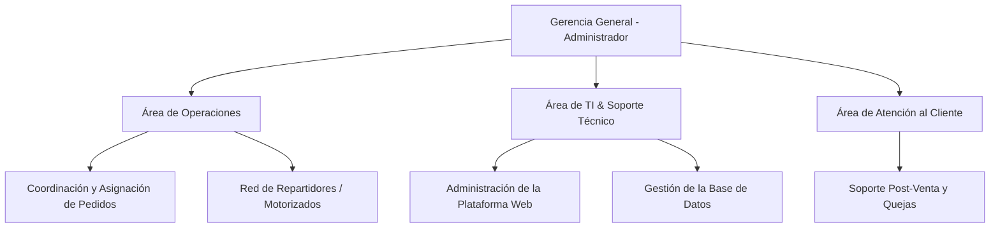
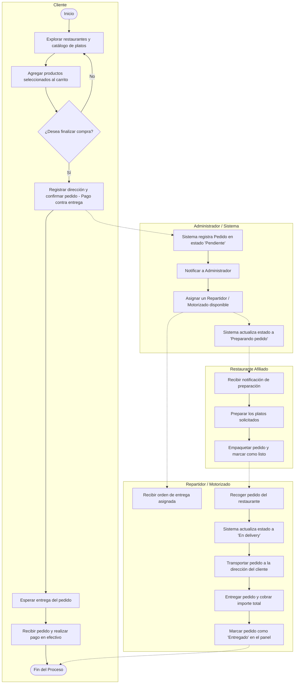
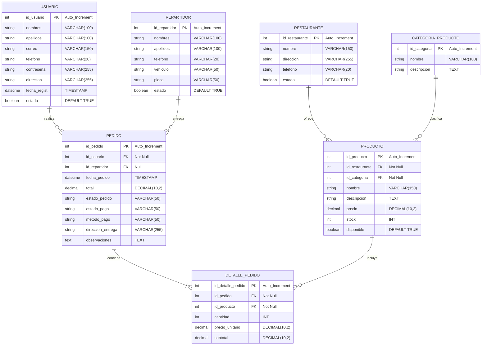

## UL 

Facultad de Ingeniería Carrera de Ingeniería de Sistemas e Informática 

Marcos de Desarrollo Web Profesor: Omar Julio Valencia Gallegos **Tema del Proyecto Final: “Aplicación web de delivery”** Estudiantes: 

Código Nombres y Apellidos U24315072 Mercado Chuctaya, Jose Manuel U23304748 Huamani Mejia, Cristofer Adrian U23242026 Davila Guerra, Duvan Isai U25310538 Huayhua Huisa, Gilder Manuel U23262556 Alejo Alvarez, Yamilet Mayte 

## Año: 

2026 

## 1. Descripción del trabajo 

La aplicación web de delivery está orientada a facilitar la gestión integral de pedidos en línea, permitiendo a los usuarios registrarse, explorar un catálogo de productos, realizar compras, efectuar pagos y realizar el seguimiento en tiempo real del estado de sus pedidos. Asimismo, el sistema contará con un panel administrativo para la gestión de productos y pedidos. 

## 2. Análisis del Contexto 

- 2.1. Descripción de la Institución 

Nombre:ChasquiPedidos 

Ubicación: Av. Ejército 738, Cayma, Arequipa, Perú. 

Rubro de negocio: Servicios de delivery de comida y productos de restaurantes locales. 

A qué se dedica: 

ChasquiPedidos es una empresa dedicada a la intermediación entre restaurantes locales y clientes finales en la ciudad de Arequipa. Su actividad principal consiste en gestionar pedidos de clientes, coordinar la preparación con los restaurantes afiliados y administrar la entrega de productos a domicilio. Actualmente, la empresa opera de forma parcialmente manual, recibiendo pedidos mediante llamadas telefónicas y mensajes de WhatsApp, lo que genera retrasos e inconvenientes en la atención al cliente. 

- 2.2. Organigrama de la Empresa

El organigrama de ChasquiPedidos representa una estructura funcional diseñada para garantizar una comunicación fluida entre el área operativa, el soporte técnico y la atención al cliente, facilitando un proceso eficiente de despacho y entrega de pedidos.



*   **Gerencia General (Administrador):** Responsable de la gestión estratégica y la toma de decisiones. Administra la plataforma web, productos, categorías y tiene la facultad de asignar y reasignar repartidores.
*   **Área de Operaciones:** Coordina la recepción y despacho de los pedidos, supervisando el flujo desde que el cliente lo solicita hasta que el repartidor lo entrega.
*   **Área de TI & Soporte Técnico:** Encargada del desarrollo, mantenimiento y soporte de la aplicación web y base de datos.
*   **Área de Atención al Cliente:** Gestiona el centro de quejas y reclamos, ofreciendo soporte a los usuarios y resolviendo inconvenientes con pedidos.

## 3. Problemas Identificados 

La empresa ChasquiPedidos presenta los siguientes problemas que serán resueltos mediante la aplicación web: 

- ·Gestión manual de pedidos: 

**==> picture [6 x 21] intentionally omitted <==**

**----- Start of picture text -----**<br>
I<br>**----- End of picture text -----**<br>


Los pedidos se registran de forma manual mediante llamadas telefónicas o mensajes de WhatsApp, lo que genera errores, duplicidad de pedidos y demoras en la atención. 

## ·Ausencia de catálogo digital: 

No existe una plataforma digital donde los clientes puedan visualizar productos, precios y disponibilidad actualizada. 

## ·Falta de seguimiento del pedido: 

Los clientes no tienen forma de conocer el estado de su pedido una vez realizado, generando constantes consultas y demoras en la atención. 

## ·Dificultad en la administración: 

El administrador no cuenta con herramientas centralizadas para gestionar productos, categorías y pedidos de manera eficiente. 

## ·Pérdida de clientes: 

La mala experiencia de compra y los tiempos de respuesta lentos generan insatisfacción y pérdida de clientes recurrentes. 

3. Objetivos 

   - 3.1. Objetivos generales 

Desarrollar una aplicación web de delivery que permita gestionar pedidos de manera eficiente mediante una plataforma intuitiva y accesible. 

## 3.2. Objetivos Específicos 

   - Permitir el registro, autenticación y gestión de usuarios. 

   - Implementar un catálogo dinámico de productos filtrables por categorías. 

   - Gestionar pedidos desde su creación hasta su confirmación. 

   - Implementar un sistema de seguimiento de pedidos mediante estados. 

   - Desarrollar un panel administrativo para la gestión de productos y pedidos. 

   - Implementar el método de pago contra entrega. 

4. Alcances y limitaciones 

## 4.1. Alcances 

- Registro e inicio de sesión de usuarios. 

- Recuperación y edición básica de perfil. 

I 

- Visualización de productos por categorías. 

- Búsqueda y filtrado de productos. 

- Gestión de carrito de compras. 

- Creación y procesamiento de pedidos. 

- Pago contra entrega. 

- Seguimiento del pedido mediante estados: 

   - En proceso 

   - Preparando pedido 

   - En delivery 

   - Entregado 

- Panel administrativo para: 

   - Gestión de productos 

   - Gestión de categorías 

   - Gestión de pedidos 

   - Cambio de estado de pedidos 

## 4.2. Limitaciones 

   - No incluye integración con pasarelas de pago reales. 

   - No se implementa geolocalización en tiempo real del repartidor. 

   - El seguimiento del pedido será únicamente mediante estados del pedido. 

   - No se contempla aplicación móvil, únicamente versión web. 

   - No incluye sistema de notificaciones push. 

   - La seguridad implementada será básica. 

   - No incluye chat en tiempo real entre cliente y repartidor. 

5. Diagrama BPMN 

**==> picture [42 x 18] intentionally omitted <==**

**----- Start of picture text -----**<br>
Universidad<br>Tecnoldgica<br>**----- End of picture text -----**<br>


**==> picture [400 x 430] intentionally omitted <==**

**----- Start of picture text -----**<br>
| NO - oe<br>_. even Muestrainicio” la pagina de| Usuariocuenta? tiene “Registrardireccion”datos y correctos?¢Datos son ae<br>INICIO<br>si<br>|"Muestra el formulanio| “Cuenta registrada<br>del inicio de sesién” correctamente™<br>“Ingresa el usuario y<br>contrasefia”<br>“Mostrar<br>restaurantes/productos”<br>zs3 “Seleccionarproductos eDeseascarrito?agregario al “Agregaral carrito”el producto<br>3az<br>=<br>cDeseas seguir NO -<br>“Enviar el pedido al<br>restaurante”<br>Fy “Recibirde entrega” asignacién "Recogerestaurante el pedido del| “Repartidorcamino” en “Cobrarentrega” pago contra “Pedidocon entregado éxito”<br>**----- End of picture text -----**<br>


## 5. Diagrama BPMN

El siguiente diagrama BPMN representa el flujo del proceso de negocio de extremo a extremo (100% cubierto) para la gestión y entrega de pedidos en la plataforma **ChasquiPedidos**.



---

## 6. Modelo Entidad Relación (ER)

A continuación, se detalla el modelo lógico-relacional de la base de datos `chasqui_pedidos_db`, que sirve de base para el mapeo objeto-relacional (ORM) implementado con JPA/Hibernate.

### 6.1. Diagrama Entidad-Relación (ER)



### 6.2. Descripción de Tablas y Atributos

1.  **USUARIO:** Almacena los datos personales de los clientes que acceden al sistema para realizar pedidos. La columna `correo` actúa como identificador único para el login.
2.  **RESTAURANTE:** Registra los restaurantes afiliados con su información de contacto. La relación con los productos es de **1 a N** (un restaurante posee muchos productos).
3.  **CATEGORIA_PRODUCTO:** Clasificación general de los productos (ej. Hamburguesas, Bebidas, Pizzas). Ayuda al filtrado en la interfaz.
4.  **PRODUCTO:** Platos o productos del menú de cada restaurante. Contiene claves foráneas hacia `RESTAURANTE` e `id_categoria` de `CATEGORIA_PRODUCTO`.
5.  **REPARTIDOR:** Registra a los motorizados, su tipo de vehículo (moto, bicicleta) y placa. Son asignados a los pedidos por el administrador.
6.  **PEDIDO:** Cabecera de la orden. Contiene el estado del pedido (`Pendiente`, `Preparando`, `En delivery`, `Entregado`) y referencias al cliente (`id_usuario`) y al motorizado (`id_repartidor`).
7.  **DETALLE_PEDIDO:** Detalle de cada ítem en el pedido. Almacena la cantidad, el precio unitario pactado al momento de la compra y el subtotal.


7. Realizar la maquetación del Sistema (balsamiq) 

## 1.-Vista: Pantalla de Login: 

Permite al usuario ingresar al sistema mediante su correo y contraseña. También brinda acceso a la opción de registro en caso de no contar con una cuenta. El sistema valida los datos antes de conceder el acceso. 

## 2.-vista: Pantalla de Registro: 

Permite a los nuevos usuarios crear una cuenta ingresando sus datos personales, como nombre, correo y contraseña. Una vez registrados, los datos son almacenados en el sistema para futuros accesos. 

**==> picture [6 x 21] intentionally omitted <==**

**----- Start of picture text -----**<br>
I<br>**----- End of picture text -----**<br>


## 3.-vista: Página Principal  del Catálogo: 

Muestra el listado de restaurantes y productos disponibles en la plataforma. Incluye una barra superior de navegación y un buscador para filtrar productos. Los productos se presentan en formato de tarjetas (cards), donde el usuario puede visualizar información básica y acceder al detalle de cada uno. 

## 4.-vista:Carrito de Compras 

Permite al usuario visualizar los productos seleccionados antes de confirmar el pedido. En esta vista se pueden modificar cantidades, eliminar productos y visualizar el total de la compra. 

**==> picture [6 x 21] intentionally omitted <==**

**----- Start of picture text -----**<br>
I<br>**----- End of picture text -----**<br>


## 5.-vista:Confirmación de Pedido: 

Muestra un resumen del pedido realizado, incluyendo los productos seleccionados, el monto total y la dirección de entrega. El usuario puede confirmar la compra y proceder con el pago. 

**==> picture [6 x 21] intentionally omitted <==**

**----- Start of picture text -----**<br>
I<br>**----- End of picture text -----**<br>


## 6.-vista: Seguimiento del Pedido: 

Permite al usuario visualizar el estado de su pedido en tiempo real, desde su preparación hasta la entrega. Muestra información relevante como el estado actual y el progreso del envío. 

**==> picture [6 x 21] intentionally omitted <==**

**----- Start of picture text -----**<br>
I<br>**----- End of picture text -----**<br>


## 7.-vista:Perfil de Usuario: 

Permite al usuario gestionar su información personal. 

## 8.-vista:Panel de Administrador: 

Permite al administrador gestionar la plataforma. Desde esta vista se pueden realizar operaciones de registro, actualización y eliminación de información. 

## 7.2. Arquitectura de las Interfaces de la Aplicación Web

Las interfaces de la aplicación web **ChasquiPedidos** se han diseñado de manera interactiva y responsive utilizando **HTML5**, **Bootstrap** para el diseño de componentes modernos (tarjetas, tablas, formularios, barras de estado) y **JavaScript (Vanilla)** para consumir y procesar peticiones asíncronas con el backend.

### 7.2.1. Vista Principal del Catálogo (`index.html`)
*   **Descripción:** Es la pantalla de inicio del usuario autenticado. Presenta un banner interactivo con la marca, una barra de navegación con enlaces a su perfil y carrito, y una sección principal con las tarjetas (cards) de los productos y restaurantes.
*   **Componentes Clave:** 
    *   Filtros dinámicos por categorías (ej. Postres, Comida Rápida, Bebidas).
    *   Buscador interactivo en tiempo real.
    *   Botón "Agregar al carrito" en cada tarjeta de producto que invoca llamadas de JS para guardar el estado del carrito de compras.

### 7.2.2. Vista de Registro (`registro.html`)
*   **Descripción:** Permite a los clientes y nuevos motorizados registrarse en la plataforma.
*   **Componentes Clave:** 
    *   Campos para Nombre Completo, Correo, Contraseña, Teléfono y Dirección.
    *   Selector de Rol (`CLIENTE` o `MOTORIZADO`).
    *   Script `registro.js` que captura el submit, valida localmente los campos obligatorios, y realiza un envío mediante `fetch` POST al endpoint de registro.

### 7.2.3. Vista del Carrito de Compras (`carrito.html`)
*   **Descripción:** Muestra los ítems que el usuario ha seleccionado para comprar.
*   **Componentes Clave (100% Funcional y Conectado al Servidor):** 
    *   Carga dinámica de los productos agregados desde la página principal utilizando `localStorage`.
    *   Tabla interactiva para incrementar, decrementar la cantidad o eliminar productos recalculando subtotales y total en tiempo real.
    *   Formulario para ingresar la dirección de entrega y observaciones.
    *   **Pago Contra Entrega (Cash on Delivery):** Al hacer clic en "Confirmar pedido", se realiza una petición HTTP POST `/api/pedidos` que guarda la cabecera (`PEDIDO` en estado Pendiente y Pago Pendiente) y el detalle (`DETALLE_PEDIDO`) en la base de datos MySQL, limpiando el carrito y redirigiendo al seguimiento en tiempo real.


### 7.2.4. Vista del Panel de Motorizados (`motorizado.html`)
*   **Descripción:** Interfaz exclusiva para los repartidores registrados.
*   **Componentes Clave:** 
    *   Listado de órdenes asignadas en estado activo.
    *   Detalle del pedido a entregar (cliente, dirección de entrega, observaciones y total a cobrar).
    *   Botones de acción interactivos para cambiar el estado de la entrega a "En delivery" o "Entregado" con un solo clic.

### 7.2.5. Vista de Seguimiento de Pedidos (`seguimiento.html`)
*   **Descripción:** Interfaz visual donde el cliente monitorea la entrega.
*   **Componentes Clave (100% Dinámico con Thymeleaf):** 
    *   Carga dinámica del pedido desde la base de datos mediante su identificador único (`/seguimiento?id=...`).
    *   Barra de progreso de 4 pasos (`Pedido Recibido` -> `Preparando` -> `En camino` -> `Entregado`) que activa y resalta automáticamente la tarjeta correspondiente según el estado real guardado en MySQL.
    *   Muestra el nombre del motorizado asignado en tiempo real o `"Pendiente de asignación"` si no ha sido asignado por el administrador.
    *   Tabla dinámica con los platos comprados, cantidades y el importe final a pagar contra entrega.


### 7.2.6. Vista de Perfil de Usuario (`perfil.html`)
*   **Descripción:** Permite la consulta y actualización de la información de cuenta.
*   **Componentes Clave:** 
    *   Formulario con los datos cargados desde el servidor.
    *   Historial simplificado con la cantidad total de pedidos realizados por el usuario.

### 7.2.7. Vista de Administración (`admin.html`)
*   **Descripción:** Dashboard centralizado del administrador para controlar el funcionamiento general.
*   **Componentes Clave (100% Implementado y Conectado a Base de Datos):**
    *   Métricas rápidas automáticas en tiempo real (Pedidos totales, Usuarios registrados, Motorizados activos, Ingresos netos totales calculados dinámicamente desde la base de datos).
    *   Gestión y resolución interactiva de quejas y reclamaciones con persistencia.
    *   **CRUD de Usuarios:** Listar, visualizar detalles, editar nombres, apellidos, correo, teléfono, dirección, estado y eliminar usuarios reales de la base de datos MySQL.
    *   **CRUD de Productos:** Listar, buscar en tiempo real, crear nuevos productos (asociados a un restaurante y categoría), editar y eliminar productos reales.
    *   **CRUD de Categorías:** Listar, agregar nuevas categorías, editar y eliminar categorías reales.
    *   **Gestión de Pedidos:** Listar pedidos reales de la base de datos, cambiar su estado de preparación y delivery (`Pendiente`, `Preparando pedido`, `En delivery`, `Entregado`) y asignar repartidores activos.

---

## 8. Mapeo ORM, Relaciones y Validaciones de Datos

Para cumplir con las exigencias del **Estándar Esperado** en la rúbrica sobre la persistencia y la consistencia de datos, se ha implementado un mapeo objeto-relacional (ORM) robusto con **Spring Data JPA** e integrado validaciones a nivel de entidad.

### 8.1. Implementación de Validaciones y Restricciones ORM
Se agregaron anotaciones de la especificación **Jakarta Validation** en las clases entidad para asegurar la integridad de la base de datos y evitar que lleguen datos corruptos al repositorio:

```java
// Ejemplo de validaciones en la entidad Usuario
@Entity
@Table(name = "USUARIO")
public class Usuario {
    @Id
    @GeneratedValue(strategy = GenerationType.IDENTITY)
    @Column(name = "id_usuario")
    private Integer idUsuario;

    @NotBlank(message = "El nombre no puede estar vacío")
    @Size(max = 100, message = "El nombre no puede superar los 100 caracteres")
    @Column(nullable = false, length = 100)
    private String nombres;

    @NotBlank(message = "El apellido no puede estar vacío")
    @Size(max = 100, message = "El apellido no puede superar los 100 caracteres")
    @Column(nullable = false, length = 100)
    private String apellidos;

    @NotBlank(message = "El correo no puede estar vacío")
    @Email(message = "El formato del correo es inválido")
    @Size(max = 150, message = "El correo no puede superar los 150 caracteres")
    @Column(length = 150, unique = true)
    private String correo;

    @Size(max = 20, message = "El teléfono no puede superar los 20 caracteres")
    @Column(length = 20)
    private String telefono;

    @NotBlank(message = "La contraseña no puede estar vacía")
    @Size(min = 6, max = 255, message = "La contraseña debe tener entre 6 y 255 caracteres")
    @Column(length = 255)
    private String contrasena;
}
```

```java
// Ejemplo de relaciones y restricciones en la entidad Producto
@Entity
@Table(name = "PRODUCTO")
public class Producto {
    @Id
    @GeneratedValue(strategy = GenerationType.IDENTITY)
    @Column(name = "id_producto")
    private Integer idProducto;

    @ManyToOne
    @JoinColumn(name = "id_restaurante", nullable = false)
    private Restaurante restaurante; // Relación N:1 con Restaurante (Muchas a Una)

    @ManyToOne
    @JoinColumn(name = "id_categoria", nullable = false)
    private CategoriaProducto categoria; // Relación N:1 con Categoría de Producto

    @NotBlank(message = "El nombre del producto es obligatorio")
    @Size(max = 150)
    @Column(nullable = false, length = 150)
    private String nombre;

    @Column(precision = 10, scale = 2)
    private BigDecimal precio;
}
```

### 8.2. Interfaces Repositorios (Capa de Acceso a Datos)
Se crearon las interfaces que heredan de `JpaRepository` para automatizar las operaciones CRUD en todas las tablas primarias y secundarias:

*   **`UsuarioRepository`**: Operaciones CRUD para Clientes y autenticación.
*   **`RestauranteRepository`**: Gestión de locales.
*   **`ProductoRepository`**: Gestión de platos y productos (incluye consulta personalizada `findByRestauranteIdRestaurante`).
*   **`RepartidorRepository`**: Gestión de motorizados.
*   **`PedidoRepository`**: Creación de órdenes e historial (`findByUsuarioIdUsuario`).

---

## 9. Arquitectura y Diseño de Servicios REST (APIs)

Para la interacción con las tablas primarias de la aplicación de manera desacoplada e interactiva, se han diseñado e implementado controladores REST (`@RestController`). Estos controladores permiten realizar operaciones CRUD estándar y devuelven respuestas en formato **JSON**.

### 9.1. Tabla de Endpoints REST Desarrollados

| Entidad / Recurso | Método HTTP | Endpoint URI | Descripción | Entrada (JSON Body) | Código de Respuesta |
| :--- | :--- | :--- | :--- | :--- | :--- |
| **Usuario** | `GET` | `/api/usuarios` | Listar todos los usuarios. | Ninguno | `200 OK` |
| **Usuario** | `GET` | `/api/usuarios/{id}` | Buscar un usuario por ID. | Ninguno | `200 OK`, `404 Not Found` |
| **Usuario** | `POST` | `/api/usuarios` | Crear un nuevo usuario (Validado). | Objeto Usuario completo | `201 Created`, `400 Bad Request` |
| **Usuario** | `PUT` | `/api/usuarios/{id}` | Actualizar datos de un usuario. | Objeto Usuario completo | `200 OK`, `404 Not Found` |
| **Usuario** | `DELETE` | `/api/usuarios/{id}` | Eliminar físicamente un usuario. | Ninguno | `200 OK`, `404 Not Found` |
| **Restaurante** | `GET` | `/api/restaurantes` | Listar todos los restaurantes. | Ninguno | `200 OK` |
| **Restaurante** | `GET` | `/api/restaurantes/{id}`| Buscar restaurante por ID. | Ninguno | `200 OK`, `404 Not Found` |
| **Restaurante** | `POST` | `/api/restaurantes` | Crear nuevo restaurante. | Objeto Restaurante completo| `201 Created`, `400 Bad Request` |
| **Restaurante** | `PUT` | `/api/restaurantes/{id}`| Actualizar datos del restaurante. | Objeto Restaurante completo| `200 OK`, `404 Not Found` |
| **Restaurante** | `DELETE` | `/api/restaurantes/{id}`| Eliminar un restaurante. | Ninguno | `200 OK`, `404 Not Found` |

### 9.2. Ejemplo de Controlador REST Implementado (`UsuarioRestController.java`)
```java
@RestController
@RequestMapping("/api/usuarios")
public class UsuarioRestController {

    @Autowired
    private UsuarioRepository usuarioRepository;

    @GetMapping
    public List<Usuario> getAllUsuarios() {
        return usuarioRepository.findAll();
    }

    @PostMapping
    public ResponseEntity<Usuario> createUsuario(@Valid @RequestBody Usuario usuario) {
        Usuario nuevoUsuario = usuarioRepository.save(usuario);
        return ResponseEntity.status(HttpStatus.CREATED).body(nuevoUsuario);
    }

    @PutMapping("/{id}")
    public ResponseEntity<Usuario> updateUsuario(@PathVariable Integer id, @Valid @RequestBody Usuario detallesUsuario) {
        return usuarioRepository.findById(id).map(usuario -> {
            usuario.setNombres(detallesUsuario.getNombres());
            usuario.setApellidos(detallesUsuario.getApellidos());
            usuario.setCorreo(detallesUsuario.getCorreo());
            usuario.setTelefono(detallesUsuario.getTelefono());
            usuario.setContrasena(detallesUsuario.getContrasena());
            usuario.setDireccion(detallesUsuario.getDireccion());
            usuario.setEstado(detallesUsuario.getEstado());
            Usuario usuarioActualizado = usuarioRepository.save(usuario);
            return ResponseEntity.ok(usuarioActualizado);
        }).orElseGet(() -> ResponseEntity.notFound().build());
    }

    @DeleteMapping("/{id}")
    public ResponseEntity<Void> deleteUsuario(@PathVariable Integer id) {
        return usuarioRepository.findById(id).map(usuario -> {
            usuarioRepository.delete(usuario);
            return ResponseEntity.ok().<Void>build();
        }).orElseGet(() -> ResponseEntity.notFound().build());
    }
}
```

**==> picture [425 x 651] intentionally omitted <==**

**----- Start of picture text -----**<br>
< C — @ localhost:8080/admine 22OO9>0L 2B ol 2<br>[3 utP+ciass © Sponsor the Edipse... [3 UTP-+class : Cursos<br>hasqui | &B Solicitudes de Motorizados<br>Dashboard 2 Caros topesPedro GomezSluis Femandoa<br>Motorized 9876543211@2aros2 (_ Rect ) 106umeses x } a@“Siltao } 954321098fosuuei<br>sccm @% Motos a 3 Me<br>Ae4 Pendiente Bicicla e ta p=endlente BevoPendiente<br>48 Usuarios<br>Jorge5Huamani SRaul&reall.<br>108 x Rech ay 1015<br>— afos s<br>Bicicleta pe<br>Pendiente aa<br>@ Motorizados Actives<br>&” [Andrea] [Soto] &Javier Paredes &° Monica Rios & Esteban Quiroz<br>48% |M156 49% | M203 47% | M98 49% |M245<br>&hetive912345678 ‘923456789‘Activa &‘Activo934567890 &‘activo945678901<br>& Valentina Cruz & Diego Alarcon<br>46% |M67 5 (M312<br>&.‘Actvo956789012 &activo 967890123<br>< CG ® _localhost:8080/admin# ©9eEeBOrdaOse=zB oc! &<br>[FR utP+class @ Sponsorthe Eclipse... [FB] UTP+class =: Cursos<br>Chasqui | G8 Centro de Quejas<br>& Dashboard @@ 15/01/2025Elena Castro | Retraso en la entrega#<br>Hee Pendiente<br>©® QuejasMotorizado: @£8 140172025 [Mario] Pendiente [Linares] | Producto eqivocado {Resolver)<br>—— @ Silvia Ponce<br>@ 13/01/2025 | Mattrato del repartidor<br>© [Rafael] 8 12/01/2025 [Soto]  | Comida fia OR<br>Resuelto<br>08© Daniela11/01/2025|FloresFalté un producto #<br>Pendiente<br>@ Alberto Rivas | Pedi<br>§ 10/01/2025 | Demora excesiva<br>©8.09/01/2025Carmen |Soto Mal sabor de la comida<br>Pendiente<br>@ [Roberto] 98 08/01/2025 | [Paz] Repartidor grosero<br>Pendiente<br>< C  @® _localhost:8080/admin# Pek GoeOr0O4=zEBM O <A<br>[3 utP+class @ Sponsorthe Eclipse... [79] UTP+class : Cursos<br>1asqui | &, Usuarios del Sistema<br>& Dashboard Q CFisusla@claudia@mailvitanueva com| &, 987123456 Wiz[ive pease}<br>@ Pedidos<br>® Motorizados e BSGustavogustavo@mall Herreracom | \, 986234567 ¥8@pedidos<br>© Quejas<br>48 Usuarios e Raul Medina ¥45 pedidos<br> raul@mail.com | &, 985345678 Ci ve<br>Q  paty@malBticia unex com|984456789 WeLive}pedidos<br>e 8Joséjose. Delgadod@mail com | &, 983567890 WeC [ive]  pedidos<br>Q &Miata matiaf@mall Fernandes com | & 962678901 bltiveJ<br>@ 3cesarp@mail.comesr Pradeo | &, 961789012 WWLiveSpetiies<br>@ BBLscerohucero@mail vargascom | & 980890123 Tecqqpeciaes<br>**----- End of picture text -----**<br>


